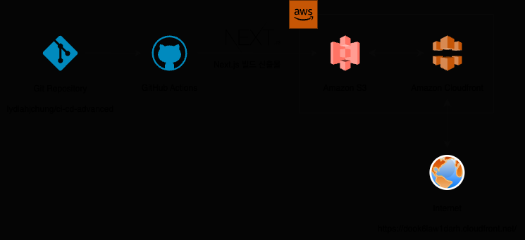

# 프론트엔드 CI/CD 파이프라인

항해 플러스 프론트엔드 2기 6주차 심화 과제

### 개요

GitHub Actions에 워크플로우를 작성해 다음과 같이 배포가 진행되도록 함

1. 저장소를 체크아웃합니다.
2. Node.js 18.x 버전을 설정합니다.
3. 프로젝트 의존성을 설치합니다.
4. Next.js 프로젝트를 빌드합니다.
5. AWS 자격 증명을 구성합니다.
6. 빌드된 파일을 S3 버킷에 동기화합니다.
7. CloudFront 캐시를 무효화합니다.

### 주요 링크

- S3 버킷 웹사이트 엔드포인트: http://hanghae-front-2nd.s3-website-us-east-1.amazonaws.com/
- CloudFront 배포 도메인 이름: https://dook6law1darh.cloudfront.net/

### 주요 개념

1. GitHub Actions 와 CI/CD 도구
2. S3 와 스토리지
3. CloudFront 와 CDN
4. 캐시 무효화 (Cache Invalidation)
5. Repository secret 과 환경변수
