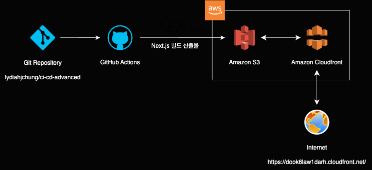

# 프론트엔드 CI/CD 파이프라인

항해 플러스 프론트엔드 2기 6주차 심화 과제

### 개요



GitHub Actions에 워크플로우를 작성해 다음과 같이 배포가 진행되도록 함

1. 저장소를 체크아웃합니다.
2. Node.js 18.x 버전을 설정합니다.
3. 프로젝트 의존성을 설치합니다.
4. Next.js 프로젝트를 빌드합니다.
5. AWS 자격 증명을 구성합니다.
6. 빌드된 파일을 S3 버킷에 동기화합니다.
7. CloudFront 캐시를 무효화합니다.

### 주요 링크

- S3 버킷 웹사이트 엔드포인트: http://hanghae-front-2nd.s3-website-us-east-1.amazonaws.com/
- CloudFront 배포 도메인 이름: https://dook6law1darh.cloudfront.net/

### 주요 개념

1. GitHub Actions 와 CI/CD 도구:
   빠른 CI/CD 시스템 구축을 위해 GitHub Actions를 사용함.
   GitHub Actions 는 GitHub에서 제공하는 CI/CD 솔루션으로 GitHub 저장소와의 밀접한 연동을 통해 코드 변경 사항을 감지하고 자동으로 워크 플로우를 실행함.
2. S3 와 스토리지:
   Amazon Simple Storage Service(S3)는 AWS에서 제공하는 객체 스토리지 서비스임.
   빌드 후의 결과물인 정적 파일들을 저장하고 제공하는 데 사용할 수 있음.
   현재 프로젝트에서는 Next.js의 빌드 파일들을 호스팅하는데 사용함.
3. CloudFront 와 CDN:
   CloudFront는 AWS 에서 제공하는 콘텐츠 전송 네트워크(CDN) 서비스임.
   CDN이란 분산 서버 네트워크를 사용하여 사용자에게 빠르고 안정적으로 웹 콘텐츠를 제공하도록 함.
   현재 프로젝트에서 S3에 저장된 것들을 효율적으로 사용자에게 제공해줌.
4. 캐시 무효화 (Cache Invalidation):
   workflow 의 `deployment.yaml` 파일에서 자동으로 실행됨.
   ```
   aws cloudfront create-invalidation --distribution-id ${{ secrets.CLOUDFRONT_DISTRIBUTION_ID }} --paths "/*"
   ```
   CloudFront의 캐시를 무효화하는 것은 사용자에게 S3의 최신 버전의 콘텐츠가 제공될 수 있도록 보장함.
5. Repository secret 과 환경변수:
   GitHub 에서 제공하는 보안 기능으로, 저장소에 민감한 정보를 안전하게 관리할 수 있음.
   현재 프로젝트에서는 AWS 자격 증명을 구성하기 위해 사용됨.
